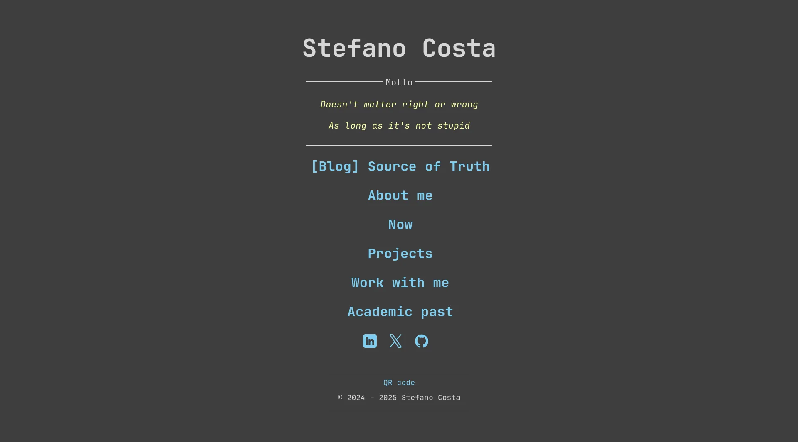
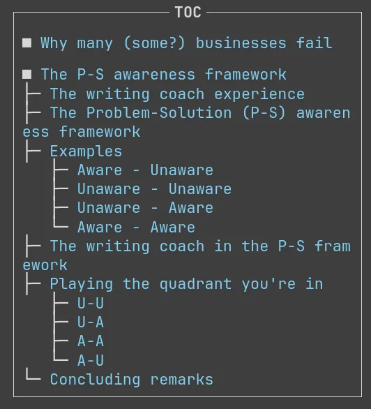
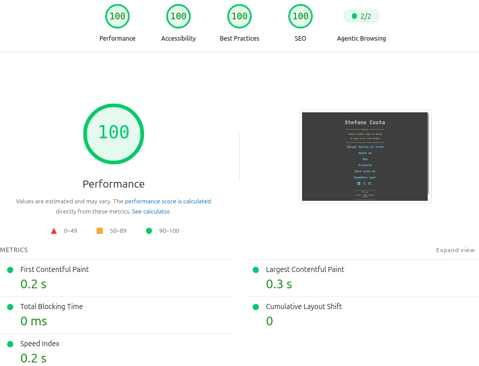

# stefanocosta.me

Personal website and blog of **Stefano Costa** — mathematician, developer, entrepreneur.

No framework. No bundler. No `node_modules`. Zero build step.
Hand-written HTML, CSS and vanilla JavaScript, served straight off GitHub Pages.

**Live:** [stefanocosta.me](https://stefanocosta.me) · **Blog:** [Source of Truth](https://stefanocosta.me/mainPages/Blog_pages.html) · [RSS](https://stefanocosta.me/mainPages/blogFeed.xml)

<p align="center">
  
  
</p>

<p align="center"><em>Homepage · a post with the auto-generated sidebar TOC</em></p>

### Lighthouse




100 across the board on both mobile and desktop, measured on the live site — with a
Cumulative Layout Shift of 0.021 and 0 ms of total blocking time. These numbers are the point
of the whole design, and [what it took to get them](#6-what-the-lighthouse-numbers-actually-came-from)
is documented below rather than left to look effortless.

---

## Why it's built this way

Most personal sites ship tens of megabytes of dependencies to render three paragraphs of text.
This one is the opposite bet: **every stylesheet and script in the project totals under 1,000
lines**, and a page loads with no runtime, no hydration, and no third-party requests at all —
fonts and icons included.

That constraint is the design. It buys three things:

- **Longevity** — nothing here can break because an upstream package cut a major version.
  This site will render identically in ten years, because there is nothing to rebuild.
- **Speed** — no render-blocking CDN round-trips. Fonts are self-hosted WOFF2 with
  `font-display: swap`, images are WebP, and non-critical images are lazy-loaded.
- **Privacy** — no analytics, no trackers, no external font or script hosts. A visitor's
  browser talks to exactly one origin.

The usual price of going frameworkless is duplication: every page re-declaring the same
`<head>`, footer and metadata. That price is engineered away below.

---

## Architecture

### 1. The shared `<head>`, and why it stopped being JavaScript

Without a template engine, every page has to repeat its own `<head>`. The obvious fix is a
script that injects the shared parts, and that is what this site did: one
[`commonHeader.js`](javascript/commonHeader.js) tag added the favicon, the stylesheet link and
the Open Graph metadata, deriving the site root from its own `src` so the same file worked from
any directory.

It was convenient and wrong, for two independent reasons:

- **Crawlers don't run JavaScript.** LinkedIn, WhatsApp and Slack read the HTML they are
  served. An `og:image` added at runtime does not exist as far as they are concerned, so link
  previews were silently broken on every page.
- **It sat on the critical path.** A synchronous script in the `<head>` blocks rendering, and
  nothing it did was needed for the first paint.

So the shared parts are now written into the HTML, where they belong. It is more bytes of
markup and less cleverness, which is the right trade when the alternative costs both
correctness and speed:

```html
<link rel="preload" href="../style/fonts/JetBrainsMono-Regular.woff2" as="font" type="font/woff2" crossorigin>
<link rel="preload" href="../style/fonts/JetBrainsMono-Bold.woff2"    as="font" type="font/woff2" crossorigin>
<link rel="stylesheet" href="../style/base.css">
<meta property="og:title" content="…">
<script src="../javascript/commonHeader.js" defer></script>
```

The script survives as a **safety net rather than a dependency**: deferred, and structured so
each thing it adds is conditional on that thing being absent.

```js
if (!has('link[rel="stylesheet"][href$="style/base.css"]')) {
    add('link', { rel: 'stylesheet', href: root + 'style/base.css' });
}
```

On a correctly written page it does nothing at all. On a page where someone forgot a tag, it
prevents an unstyled render or a missing preview image. That is a good use for JavaScript on a
static site; generating metadata that a crawler needs is not.

Two fonts are preloaded, not one: headings inherit the browser's default bold, so the Bold
file is on the critical path exactly as much as Regular — something the Lighthouse dependency
tree showed and intuition did not.

### 2. A table of contents that infers document structure

[`toc.js`](javascript/toc.js) builds the blog sidebar by walking `h2`/`h3`/`h4` and drawing
box characters that reflect real nesting depth. It looks ahead to the *next* heading to decide
whether a branch continues (`├─`) or terminates (`└─`):

```
■ The corporate experience
  ├─ What I expected
  └─ What I got
■ Leaving
```

Authors write semantic headings; navigation is derived, never hand-maintained.

### 3. RSS generated from the published pages

[`scripts/gen_feed.py`](scripts/gen_feed.py) — Python standard library only, no dependencies —
regenerates the blog feed by parsing the site's own HTML. It reads each post's
[JSON-LD `BlogPosting`](https://schema.org/BlogPosting) block for `datePublished`, then
extracts title, subtitle, epistemic status, word count, reading time and section headings to
build a rich `<description>` per item.

```bash
python3 scripts/gen_feed.py
```

Posts without `datePublished` — the template, test drafts — are skipped automatically, so
staging content cannot leak into the feed. **The feed is a build artifact and is never edited
by hand.**

### 4. Styles composed, not bundled

[`base.css`](style/base.css) is the single always-on sheet: reset, self-hosted `@font-face`
declarations, design tokens as custom properties (colour, spacing, type scale), layout,
components, and the responsive breakpoints — in that order, because the breakpoints
deliberately override several component rules at narrow widths. Everything else is opted into
per page:

| Stylesheet | Loaded when |
|---|---|
| `blog.css` | Post layout with fixed sidebar TOC |
| `gallery.css` | The page contains a slideshow |
| `about_me_cards.css` | `aboutme.html` only |

**Half the pages load exactly one stylesheet**, and none loads more than three. It's
tree-shaking, performed by reading the page you just wrote.

### 5. Zero third-party requests, verified

The site previously pulled a ~75 KB Font Awesome bundle from a CDN on 22 pages — to render
**five** distinct icons, on two of them. Those icons are now inline `<svg>` elements (Font
Awesome Free paths, CC BY 4.0) sharing one class:

```css
.fa_icon { color: #6ed6f0; width: 1.5em; height: 1.5em; vertical-align: middle; }
```

Each path uses `fill="currentColor"`, so a single CSS rule colours every icon and the SVG
inherits hover and theme changes for free. Combined with self-hosted WOFF2 fonts, the result
is a site where **no page makes a request to any host but its own** — which is a privacy
guarantee, not just a performance one.

### 6. What the Lighthouse numbers actually came from

Being static buys a good score, not a perfect one. Desktop Performance started at **81**.
Three fixes took it to 100:

**Layout shift.** The social icons had no intrinsic size, so the browser could not reserve
space for them and the page visibly jumped as they arrived (CLS 0.397 — the "good" threshold
is 0.1). The fix is to state the real pixel dimensions in the HTML and let CSS scale them:

```html

```
```css
.icon { width: 30px !important; height: auto; }
```

The attributes give the browser the aspect ratio before a single byte of the image is
downloaded; `height: auto` keeps CSS in charge of the displayed size. They were also marked
`loading="lazy"` despite sitting above the fold — which delays exactly the images the user is
already looking at. Removed.

**Render-blocking CSS.** Having `commonHeader.js` inject the stylesheet meant the browser
couldn't discover `base.css` until it had fetched and run the script. Each page now links it
directly, and the loader only injects it if it isn't already there:

```js
if (!document.querySelector('link[rel="stylesheet"][href$="style/base.css"]')) {
    addStylesheet(folder + "base.css");
}
```

The stylesheet is now fetched during HTML parsing, the critical font is preloaded, and the
script's convenience is kept as a fallback rather than a dependency.

**One request instead of a chain.** That fix had a side effect worth naming: with the CSS now
in real `<link>` tags, `base.css` and `components.css` became *two* render-blocking requests
in series, which Lighthouse duly flagged. Since both were loaded by all 29 pages, they were
never really two things — the components rules were merged into `base.css`, between the base
rules and the media queries, and `components.css` was deleted.

Order matters there: the breakpoints deliberately override `.index_img`, `.poster_img`,
`.divTd`, `.list_span` and the two-column rules at narrow widths, so they have to stay last.
The merge was verified by diffing the resolved cascade before and after — same 95 rules, zero
computed differences. Half the pages now load a single stylesheet.

**Getting the script off the critical path.** Even at 100/100, Lighthouse still listed
`commonHeader.js` as render-blocking — 1.6 KB costing 450 ms on mobile, for work that only
mattered after the page was already visible. Moving its output into static HTML (see
[§1](#1-the-shared-head-and-why-it-stopped-being-javascript)) let it become `defer`, which
removed it from the critical path and fixed the broken social previews at the same time.

The remaining chain is the shortest one a styled page can have: HTML → CSS → fonts. Both
critical fonts are preloaded so they start downloading alongside the stylesheet instead of
after it, and `base.css` uses root-relative `url()` paths so it resolves identically from
every directory.

Where specificity fights are unavoidable, the losing side is documented rather than patched
with a blind `!important`:

```css
/* !important needed: utility class must win over contextual alignment rules */
.center { text-align: center !important; margin: auto; flex: 1; }
```

---

## Repository layout

```
├── index.html              Homepage
├── 404.html                Custom error page
├── CNAME                   Custom domain for GitHub Pages
├── sitemap.xml             Priority-weighted, 26 URLs
├── robots.txt              Excludes /document/ and the post template
├── CLAUDE.md               Authoring contract (see below)
│
├── mainPages/              About · Blog index · Projects · Now · Colophon · Work with me
│   └── blogFeed.xml        ← generated by scripts/gen_feed.py
├── blogPosts/              Long-form posts
│   └── _template.html      Canonical skeleton for a new post
├── subpages/               Academic work: thesis, posters, conferences
├── document/               Academic PDFs (excluded from indexing)
│
├── style/                  base.css + 3 opt-in component sheets
│   └── fonts/              Self-hosted JetBrains Mono (WOFF2)
├── javascript/             5 files, zero dependencies
├── scripts/gen_feed.py     RSS generator (stdlib only)
└── img/                    WebP throughout
```

---

## Engineering conventions

Documented as a machine-readable contract in [`CLAUDE.md`](CLAUDE.md), so an AI assistant
produces pages indistinguishable from hand-written ones.

**Performance**
- WebP for every image; `preview_image.jpg` stays JPG for OG crawler compatibility
- `loading="lazy"` on below-the-fold images only — never above the fold
- Every `` carries explicit `width`/`height` so the browser reserves space
- Fonts self-hosted in three weights, `font-display: swap`

**SEO**
- Unique `<meta name="description">` per page, ≤160 characters
- Every post ships Schema.org `BlogPosting` JSON-LD — which doubles as the feed's data source
- `sitemap.xml` priority-weighted: main pages `0.8–0.9`, posts `0.7`, academic subpages `0.4–0.5`

**Accessibility**
- Every page wraps its content in a `<main>` landmark, so screen-reader users can skip
  straight to it
- Icon-only `<button>` requires `aria-label`; inline SVGs are `aria-hidden` so the label is
  the single source of truth
- Image-only links require a descriptive `alt`, or an `aria-label` on the anchor
- Decorative icons next to text use `alt=""` so screen readers don't read them twice

---

## Publishing a post

```bash
cp blogPosts/_template.html "blogPosts/New Post.html"
```

1. Fill the `<head>`: description, title, `data-og-*` attributes, JSON-LD `datePublished`
2. Write the body with semantic `<h2 id="...">` headings — the TOC derives itself
3. Add the entry at the **top** of `mainPages/Blog_pages.html`
4. Add the URL to `sitemap.xml` with `priority` `0.7`
5. Regenerate the feed: `python3 scripts/gen_feed.py`

Full checklist in [`CLAUDE.md`](CLAUDE.md).

---

## Deployment

Served by **GitHub Pages** directly from `main` — the repository *is* the deployment artifact,
so what you clone is byte-for-byte what ships. The [`CNAME`](CNAME) file points Pages at the
custom domain; DNS is handled by Cloudflare, and every canonical URL in the sitemap, feed and
JSON-LD uses `stefanocosta.me` so search engines never see two hostnames for one page.

There is no CI step, by choice: a build pipeline whose only job is to copy files is a moving
part that can fail for no benefit. Images are converted to WebP locally before committing:

```bash
find img/ -name "*.jpg" -o -name "*.png" | while read f; do
  cwebp -q 80 "$f" -o "${f%.*}.webp"
done
```

---

## Local development

No toolchain, no install step:

```bash
git clone https://github.com/St-Costa/personal-site.git
cd personal-site
python3 -m http.server 8000
```

Open <http://localhost:8000>. A static file server is required — rather than opening the HTML
file directly — because `commonHeader.js` resolves the site root from `script.src`.

---

## License

Code is free to learn from and adapt. Written content, images and academic documents are
© Stefano Costa — please ask before reusing.
